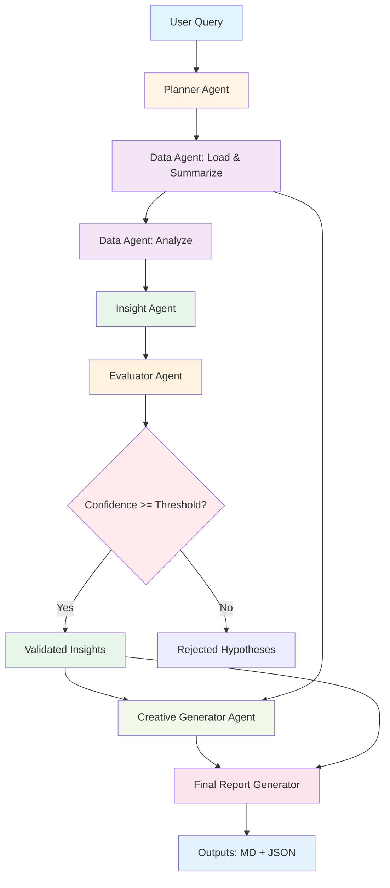

# Agent Graph & Architecture

## Overview

This document describes the multi-agent system architecture, agent roles, data flow, and interaction patterns.

## High-Level Flow

```
User Query → Planner → Data Agent → Insight Agent → Evaluator → Creative Generator → Report
```

## Detailed Agent Graph



## Agent Descriptions

### 1. Planner Agent

**Role**: Query Decomposition & Task Planning

**Input**:
- User query (string)
- High-level data summary

**Processing**:
1. Understand user intent
2. Identify required metrics and analyses
3. Break down into subtasks
4. Assign subtasks to appropriate agents
5. Determine task dependencies and priorities

**Output**:
```json
{
  "query_understanding": "...",
  "required_metrics": ["roas", "ctr", "spend"],
  "subtasks": [
    {
      "task_id": 1,
      "description": "Analyze ROAS trend over last 7 days",
      "agent": "data",
      "dependencies": [],
      "priority": "high"
    }
  ],
  "expected_insights": ["..."]
}
```

**Prompt Strategy**: 
- Structured thinking framework (Understand → Analyze → Plan)
- JSON schema enforcement
- Clear agent routing logic

---

### 2. Data Agent

**Role**: Data Loading, Processing, and Quantitative Analysis

**Input**:
- Task description from planner
- Optional context

**Processing**:
1. Load Facebook Ads CSV data
2. Filter relevant date ranges
3. Aggregate by dimensions (campaign, creative, time)
4. Calculate trends and comparisons
5. Identify top/bottom performers
6. Detect anomalies

**Output**:
```json
{
  "summary": "High-level findings",
  "data_segments": [
    {
      "segment_name": "Last 7 Days",
      "metrics": {"roas": 3.45, "ctr": 0.018},
      "trends": "Declining",
      "sample_size": 500
    }
  ],
  "key_findings": ["Finding 1", "Finding 2"],
  "anomalies": ["Unusual spike on 2025-01-15"],
  "confidence": 0.85
}
```

**Key Methods**:
- `load_data()`: Loads and cleans CSV
- `get_data_summary()`: Creates overview
- `execute()`: Performs specific analysis
- `get_low_ctr_campaigns()`: Identifies underperformers
- `get_top_performers()`: Identifies best creatives

**Data Transformations**:
- Time series aggregation (daily, weekly)
- Group-by operations (campaign, creative type, platform)
- Percentage change calculations
- Statistical summaries (mean, median, percentiles)

---

### 3. Insight Agent

**Role**: Hypothesis Generation & Pattern Explanation

**Input**:
- Analysis context
- Data summary from Data Agent

**Processing**:
1. Observe patterns in data
2. Generate multiple hypotheses
3. Provide supporting evidence
4. Identify potential root causes
5. Assess preliminary confidence
6. Suggest validation approaches

**Output**:
```json
{
  "hypotheses": [
    {
      "hypothesis_id": "H1",
      "title": "Creative Fatigue in Video Ads",
      "description": "Video ad CTR declined 35% over 14 days...",
      "supporting_evidence": [
        "CTR dropped from 0.025 to 0.016",
        "Same creative ran continuously"
      ],
      "potential_causes": [
        "Audience saturation",
        "Ad frequency too high"
      ],
      "affected_segments": ["Video", "Retargeting audience"],
      "confidence": 0.75,
      "testable": true,
      "validation_approach": "Compare CTR by creative age"
    }
  ],
  "overall_assessment": "...",
  "recommended_actions": ["Refresh video creative", "Test new hooks"]
}
```

**Hypothesis Categories**:
- Creative fatigue
- Audience saturation
- Competitive changes
- Seasonal effects
- Platform/placement issues
- Message-market fit problems

**Reasoning Framework**: Observe → Hypothesize → Reason → Assess

---

### 4. Evaluator Agent

**Role**: Hypothesis Validation & Quality Control

**Input**:
- Hypotheses from Insight Agent
- Quantitative evidence from Data Agent
- Data summary

**Processing**:
1. Parse hypothesis claims
2. Test against quantitative evidence
3. Calculate confidence scores
4. Identify supporting/contradicting evidence
5. Assess statistical significance
6. Filter by confidence threshold

**Output**:
```json
{
  "evaluations": [
    {
      "hypothesis_id": "H1",
      "validation_status": "confirmed",
      "confidence_score": 0.85,
      "evidence_summary": {
        "supporting": ["CTR declined 35% (0.025→0.016)"],
        "contradicting": [],
        "missing": ["Ad frequency data"]
      },
      "statistical_measures": {
        "metric_change_pct": -35.0,
        "sample_size": 450,
        "effect_magnitude": "large"
      },
      "reasoning": "Strong evidence supports creative fatigue...",
      "reliability": "high"
    }
  ],
  "validated_insights": ["Insight 1", "Insight 2"],
  "rejected_hypotheses": ["H3: Insufficient evidence"],
  "requires_more_data": []
}
```

**Validation Criteria**:

| Confidence Score | Criteria | Status |
|-----------------|----------|--------|
| 0.8 - 1.0 | Strong quantitative evidence, clear pattern | ✅ Confirmed |
| 0.6 - 0.79 | Moderate evidence, plausible explanation | ⚠️ Partial |
| 0.4 - 0.59 | Weak evidence, speculative | ❓ Uncertain |
| 0.0 - 0.39 | Insufficient/contradicting evidence | ❌ Rejected |

**Critical Function**: Acts as quality gate - only high-confidence insights proceed

---

### 5. Creative Generator Agent

**Role**: Creative Recommendations & Ideation

**Input**:
- Low-performing campaigns (from Data Agent)
- Top-performing creatives (from Data Agent)
- Validated insights (from Evaluator)

**Processing**:
1. Diagnose why current creatives underperform
2. Extract patterns from top performers
3. Generate diverse creative variations
4. Ground ideas in proven messaging
5. Provide testing strategy

**Output**:
```json
{
  "recommendations": [
    {
      "campaign_name": "Men ComfortMax Launch",
      "current_issue": "Low CTR (0.012) due to weak hook",
      "creative_variations": [
        {
          "variant_id": "V1",
          "creative_type": "Video",
          "headline": "No More Ride-Up Guarantee",
          "message": "Premium comfort that actually stays in place...",
          "cta": "Shop Risk-Free",
          "rationale": "Benefit-first hook + guarantee = proven pattern",
          "testing_priority": "high",
          "expected_improvement": "CTR: +30%, ROAS: +15%",
          "inspired_by": "Top performer: 'No ride-up guarantee'"
        }
      ],
      "estimated_confidence": 0.78
    }
  ],
  "creative_patterns": {
    "winning_themes": ["Comfort", "Quality guarantees", "Problem-solution"],
    "effective_hooks": ["No ride-up", "Breathable", "Seamless confidence"],
    "best_ctas": ["Shop Risk-Free", "Limited Offer", "Feel the Difference"]
  },
  "testing_strategy": "A/B test 3 variants, 7-day test window"
}
```

**Creative Framework**:
- Problem → Solution → CTA structure
- Benefit-first messaging
- Social proof integration
- Urgency/scarcity elements
- Platform-specific optimization

---

## Data Flow

### Stage 1: Planning
```
User Query 
    ↓
Planner Agent
    ↓
Task Plan (JSON)
```

### Stage 2: Analysis
```
Task Plan
    ↓
Data Agent (load data)
    ↓
Data Summary
    ↓
Data Agent (analyze)
    ↓
Quantitative Analysis (segments, trends, anomalies)
```

### Stage 3: Insight Generation
```
Analysis Results
    ↓
Insight Agent
    ↓
Hypotheses (with preliminary confidence)
```

### Stage 4: Validation
```
Hypotheses + Evidence
    ↓
Evaluator Agent
    ↓
Validated Insights (confidence >= threshold)
Rejected Insights (confidence < threshold)
```

### Stage 5: Creative Recommendations
```
Validated Insights + Top Performers + Low Performers
    ↓
Creative Generator Agent
    ↓
Creative Recommendations (variants, rationale, strategy)
```

### Stage 6: Report Generation
```
All Agent Outputs
    ↓
Report Generator (Orchestrator)
    ↓
• report.md (markdown)
• insights.json (structured)
• creatives.json (structured)
• execution_*.json (logs)
```

---

## Communication Patterns

### 1. Sequential Execution
Most agents execute sequentially due to dependencies:
```
Planner → Data Agent → Insight Agent → Evaluator → Creative Generator
```

### 2. Parallel Potential
Some operations could be parallelized:
- Data Agent: Multiple analysis tasks
- Creative Generator: Multiple campaign recommendations

### 3. Feedback Loops
Potential for iteration (not currently implemented):
```
Evaluator (low confidence) → Insight Agent (refine hypothesis) → Evaluator (re-test)
```

---

## Error Handling

Each agent includes:
1. **Input Validation**: Check required fields
2. **JSON Parsing**: Robust extraction from LLM responses
3. **Fallback Logic**: Default values for missing data
4. **Logging**: Structured error traces

---

## Agent Configuration

All agents share base configuration:

```yaml
llm:
  model: "claude-sonnet-4-20250514"
  temperature: 0.7
  max_tokens: 4000

thresholds:
  confidence_min: 0.6
  low_ctr_threshold: 0.015
  low_roas_threshold: 2.0
```

---

## Prompt Engineering Strategy

### Common Patterns Across Agents

1. **Structured Output**: All agents output JSON with defined schemas
2. **Reasoning Framework**: Think → Analyze → Conclude
3. **Evidence Grounding**: Always reference data
4. **Confidence Scoring**: Explicit uncertainty quantification
5. **Reflection Points**: Self-assessment of output quality

### Agent-Specific Prompt Features

| Agent | Key Prompt Elements |
|-------|-------------------|
| Planner | Task decomposition examples, routing logic |
| Data Agent | Quantitative analysis focus, statistical measures |
| Insight Agent | Hypothesis categories, causation vs correlation |
| Evaluator | Validation criteria, confidence thresholds |
| Creative Generator | Pattern extraction, creative best practices |

---

## Observability & Debugging

### Log Structure
```json
{
  "timestamp": "2025-01-15T10:30:00",
  "agent": "evaluator",
  "event": "complete",
  "data": {
    "validated": 3,
    "total": 5,
    "duration_ms": 4500
  }
}
```

### Debug Points
1. After Planner: Check task decomposition
2. After Data Agent: Verify data summary and analysis
3. After Insight Agent: Review hypothesis quality
4. After Evaluator: Check confidence scores
5. After Creative Generator: Validate recommendations

---

## Performance Characteristics

| Agent | Avg Execution Time | LLM Calls | Token Usage |
|-------|-------------------|-----------|-------------|
| Planner | 3-5s | 1 | ~1,000 |
| Data Agent | 2-4s | 1 | ~2,000 |
| Insight Agent | 4-6s | 1 | ~1,500 |
| Evaluator | 5-7s | 1 | ~2,500 |
| Creative Generator | 6-8s | 1 | ~2,000 |
| **Total** | **20-30s** | **5** | **~9,000** |

---

## Future Enhancements

1. **Memory System**: Store validated insights across runs
2. **Agent Parallelization**: Execute independent tasks concurrently
3. **Dynamic Routing**: Planner adjusts workflow based on query complexity
4. **Self-Healing**: Agents retry on low confidence
5. **Human-in-Loop**: Optional approval gates for critical decisions
6. **Multi-Model Support**: Use different models for different agents

---

## Conclusion

This agent architecture balances:
- **Modularity**: Each agent has clear responsibility
- **Validation**: Critical quality control via Evaluator
- **Observability**: Comprehensive logging
- **Extensibility**: Easy to add new agents or modify workflows

The system prioritizes **quality over speed**, ensuring all outputs are grounded in data and validated for confidence.
